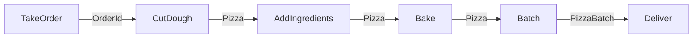

# TPL Dataflow

```shell
dotnet add package System.Threading.Tasks.Dataflow
```

## Block Types

**Normal**
* ActionBlock
* BatchBlock
* BufferBlock
* TransformBlock
* TransformManyBlock

**Special**
* BetchedJoinBlock
* JoinBlock
* WriteOnceBlock


## Pizza Flow



## Topics

* Backpressure
* Parallelism
* 